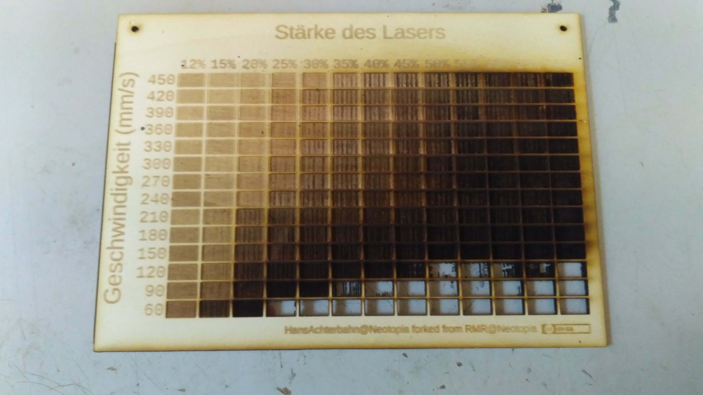

# Gravurtabellen für Lasercutter (optimiert für RDWorks)

## Allgemein

Dieses Repo enthält Tabellen, welche genutzt werden können, um die Gravurleistung von Schneidlasern festzustellen. Wie man im nachfolgenden Bild erkennen kann beinhaltet jede Zelle der Tabelle ein Kästchen, dem eine Laserleistung und eine Fahrtgeschwindigkeit zugeordnet ist.

## RDWorks

Die Gravurtabellen wurden für das Programm RDWorks im RLD Format angelegt. Da RDWorks nicht genügend Layer zur Verfügung stellt, um jeder Tabellenzelle einen separaten Layer mit eigenen Einstellungen zuzuordnen, war es nötig für eine Tabelle mehrere Dateien anzulegen. Die Dateien einer Tabelle befinden sich immer gemeinsamen im Ordner **RDWorks** und müssen nacheinander vom Laser abgearbeitet werden.

## Handling

Die Dateien für die verschiedenen Gravurtabellen liegen in jeweils einem Ordner. Aktuell sind zwei Gravurtabellen verfügbar.

**30-150:** Eine Tabelle mit 30 - 150 mm/s Verfahrgeschwindigkeit und 12 - 70 % Laserleistung
**90-450:** Eine Tabelle mit 90 - 450 mm/s Verfahrgeschwindigkeit und 12 - 70 % Laserleistung

In diesen Tabellenordnern befinden sich jeweils zwei Unterordner: Inkscape (Rohdaten) und RDWorks (Produktionsdaten).

### Inkscape (Rohdaten)

In diesem Ordner sind die Rohdaten, welche zum Entwurf der Tabelle verwendet wurden. Diese braucht man nur anfassen, wenn man selbst eine Tabelle mit anderen Werten anlegen möchte. Die Daten wurden mit Inkscape erstellt.

**00-Gravurtabelle-Schrift.svg:** Das ist die Datei, die Ursprünglich zum Entwurf der Tabelle verwendet wurde.
**01-Gravurtabelle-gepfadet,svg:** Das ist die Datei, in der alle Schriften von '00-Gravurtabelle-Schrift.svg' in Pfade umgewandelt worden sind. Das ist nötig, weil Schriften sonst nicht ins DFX Format exportiert werden können.
**02-Gravurtabelle-gepfadet.dxf:** Diese Datei ist ein DFX (R14) Export der Datei '01-Gravurtabelle-gepfadet,svg'. DFX Dateien können in RDWorks importiert und weiterbearbeitet werden.

### RDWorks (Produktionsdaten)

In diesem Ordner befinden sich die Produktionsdaten für die Tabelle. Diese müssen nacheinander auf dem selben Werkstück ablaufen.

1. Dazu öffnet man die Dateien angefangen mit 'Gravurtabelle_A-Rahmen-Achsen.rld' mit RDWorks, sendet sie an den Lasercutter und lässt sie auf dem Lasercutter ablaufen.
2. Anschließend öffnet man die nächste Datei 'Gravurtabelle_B-Reihe-060.rld' in RDWorks, sendet sie an den Lasercutter und lässt sie auf dem Laser laufen.
3. Diese Schritte wiederholt man solange, bis man bei 'Gravurtabelle_P-Rand-ausschneiden.rld' angekommen ist.

Fertig!

## Ergebnis
Das nachfolgende Bild zeigt die Gravurtabelle des Neotopia Schneidlasers vom 04.05.2019 auf 3 mm Sperrholzplatte.

